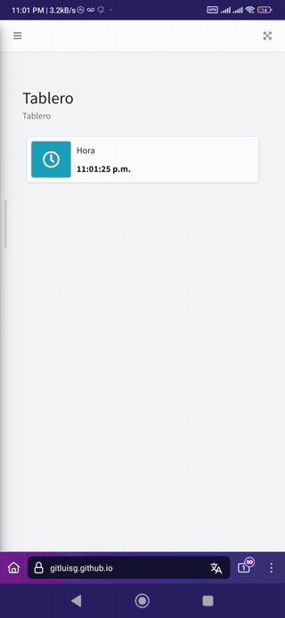

# Framework React Js
<div>
    <br/>
    <p align="center">
        <a href="www.upvictoria.edu.mx/" target="_blank">
            
        </a>
    </p>
    <br>
    <div>
        <p align="center">Framework React Js</p>
    </div>
    <div>
        <p align="center">
            <a href="https://www.php.net/" target="_blank">Javascript</a> | <a href="https://es.wikipedia.org/wiki/Modelo%E2%80%93vista%E2%80%93controlador" target="_blank">React Js 16</a>| <a href="https://getbootstrap.com/" target="_blank">Boostrap 5.3</a>
        </p>
    </div>
</div>

## Funciones
- Sistema de rutas
- Sistema de post envio
- Sitema modular
- Ligero y productivo
- Para Diseños moviles y de computadora

## Instalación

#### Pasos :
 - 1 -.Generamos una instancia de la clase RouterComponent y utilizamos unas de sus acciones para generar una ruta 
```Javascript
    get_ruter("Home", "Index");
```

- 2 -.Asignamos nuevas librerias
```Javascript
    Dentro del sistema raiz se encuentra la carpeta assets del sistema puedes incorporar tus librerias en esa carpeta.
```


## Capturas

Ejemplos de aplicaciones
<hr>


<hr>
<a href="https://gitluisg.github.io" target="_blank">Ejemplo</a>
<hr>
## Acerca de: Fue escrito por [Luis Gerardo Perales Torres](https://github.com/GitLuisG)
